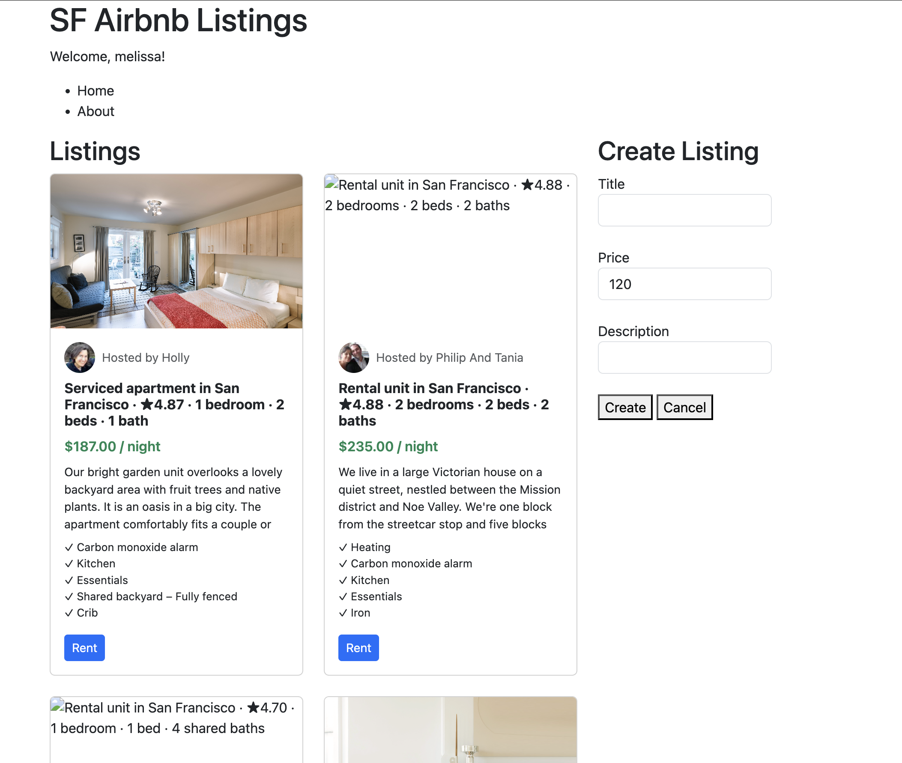

# SF Airbnb Listings

A simple web app that dynamically loads and displays Airbnb listings from a JSON dataset using JavaScript fetch and the DOM.

## Screenshot



## Objective

Demonstrate how to use JavaScript (async/await, fetch, DOM manipulation) to load and render data from a local JSON file without a backend. Built as a learning example for loading real-world data dynamically into a web page.

## Project Structure

```
WebDev_Java_Dom/
├── index.html                      # Main HTML page
├── css/
│   └── main.css                    # Custom styles
├── js/
│   └── main.js                     # Fetch, DOM rendering, event listeners
├── airbnb_sf_listings_500.json     # Dataset of 500 SF Airbnb listings
├── screenshot.png                  # App screenshot
├── package.json                    # Project metadata and dev dependencies
└── README.md
```

## Creative Add-on — Personalized Welcome Message

When the page first loads, a dialog prompts the user for their name. If provided, a personalized greeting (e.g. "Welcome, Melissa!") is displayed in the header using `document.querySelector` and `textContent`. This adds a personal touch to the experience and demonstrates basic DOM manipulation and JavaScript interactivity.

## Tech Requirements

- A modern web browser
- A local web server (e.g. [VS Code Live Server](https://marketplace.visualstudio.com/items?itemName=ritwickdey.LiveServer)) to run locally
- No build tools or frameworks required

## How to Install / Use

1. Clone the repository:
   ```bash
   git clone https://github.com/mrejuan3/WebDev_Java_Dom.git
   ```
2. Open the project folder in VS Code
3. Right-click `index.html` → **Open with Live Server**
4. The page will open at `http://localhost:5500`

Or view the live version on GitHub Pages: [https://mrejuan3.github.io/WebDev_Java_Dom/](https://mrejuan3.github.io/WebDev_Java_Dom/)

## AI Assistance

This README was generated with the help of an AI assistant (Claude) using the following prompt:

> I want to thank a full stack engineer with a lot of experience in JavaScript to help create a README file for this project, which is just a simple example on how to load Airbnb listings using JavaScript. You can follow this guide that was provided by my professor.

## Author

**Melissa Rejuan** — [GitHub Profile](https://github.com/mrejuan3)

## Class Reference

Built as part of [Web Development](https://johnguerra.co/classes/webDevelopment_online_summer_2026/) taught by John Guerra.

## License

MIT
